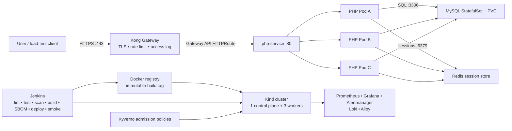

# CNAS reference architecture

## System context

## Deployment view

| Layer | Components | Design purpose |
|---|---|---|
| Edge/API gateway | Kong plus Gateway API resources | TLS termination, routing, rate limiting, access logging, and load distribution to ready endpoints. |
| Application | Three non-root PHP/Apache Pods on port 8080 | Stateless CRUD processing, rolling updates, health checks, horizontal scaling, and worker-node distribution. |
| Shared sessions | Password-protected Redis | Prevent PHP session and CSRF-token failures when requests reach different replicas. |
| Data | Single MySQL StatefulSet and PVC | Stable identity and persistent coursework data with tested backup/restore. |
| Network security | Calico and default-deny NetworkPolicies | Enforce only gateway→PHP, PHP→MySQL/Redis, and required DNS flows. |
| Admission security | Restricted Pod Security labels and Kyverno policies | Reject privileged/root workloads, missing resources, and mutable image tags. |
| Observability | Prometheus stack, MySQL exporter, Loki and Alloy | Metrics, dashboards, alerts, and centralized application/platform logs. |
| Delivery | Jenkins, Trivy, Docker Hub, Kustomize | Trace one commit through tests and security gates to the running image. |

## Trust boundaries and sensitive flows

1. **Untrusted client to gateway:** only the gateway is exposed on host ports 80/443. The application Service remains internal.
2. **Gateway to application:** NetworkPolicy accepts PHP traffic only from the labelled gateway namespace/Pods.
3. **Application to data services:** the PHP Pods can reach MySQL and Redis on their named ports. Other egress is denied except cluster DNS.
4. **CI to cluster:** Jenkins uses a stored kubeconfig credential. Runtime database/session values come from Jenkins credentials and are converted to a Kubernetes Secret without being committed.
5. **Monitoring boundary:** observability components have read-only scrape/log access to the required endpoints. Grafana credentials must be supplied separately from source control.

## Availability and scaling behavior

- `topologySpreadConstraints` distribute PHP replicas across worker hostnames when capacity permits.
- readiness removes an application Pod from Service endpoints when the database or session dependency is unavailable; liveness checks only the PHP/Apache process.
- the HPA changes application replicas from three to six from observed CPU metrics.
- the PDB maintains two available PHP replicas during voluntary disruptions.
- rolling updates create replacement capacity before terminating all existing replicas.
- Redis-backed sessions keep CSRF/session state consistent as traffic moves between replicas.

## Honest limitations

- Kind nodes are containers on one physical computer. They demonstrate Kubernetes node scheduling and recovery, but loss of the computer removes the whole cluster.
- MySQL and Redis each have one replica. The web tier is redundant, but the entire system is not fully highly available. MySQL backup/restore evidence reduces recovery risk but is not synchronous database failover.
- a `ReadWriteOnce` local PVC is suitable for the coursework environment, not multi-zone production storage.
- the application image is versioned and scanned; image signing and admission-time signature verification remain stretch controls.
- the CRUD application has CSRF protection but no user authentication or role-based authorization. Kong authentication or an application identity layer is required before exposing it beyond the controlled coursework environment.
- the coursework database identity is shared by runtime CRUD, migrations, and backups; production should separate these privileges.

These limitations should be stated in the report instead of describing the local demonstration as production-grade infrastructure HA.

## Requirement-to-component mapping

| Assignment requirement | Implemented by | Required demonstration |
|---|---|---|
| Docker and Kubernetes | Dockerfiles, Compose, Kind and Kustomize | Rebuild locally, deploy cleanly, show healthy containers/Pods. |
| 2–3 workers | Three Kind workers | Show all nodes Ready and PHP placement with `-o wide`. |
| API gateway | Kong and Gateway API | Show route, TLS, rate limit rejection, and gateway access log. |
| Load balancing | Kong, Service and three PHP endpoints | Return Pod identity repeatedly and observe more than one backend. |
| Security | non-root 8080, Secrets, Calico, Kyverno, scans | Demonstrate allowed/denied network paths and rejected insecure Pods/images. |
| Resilience/HA | replicas, topology spread, probes, PDB, rolling strategy | Delete a Pod, drain one worker, and run continuous requests during rollout. |
| Scalability | HPA and Metrics Server | Apply load and graph replicas increasing/decreasing. |
| Monitoring/auditing | Prometheus/Grafana/Alertmanager/Loki/Alloy plus deployment annotations | Trigger and recover alerts; trace a commit to logs and running image. |
| Secure CI/CD | Jenkins tests, Trivy, SBOM, immutable tag, smoke test, guarded rollback | Show a failed gate and one successful commit-to-deployment run. |
